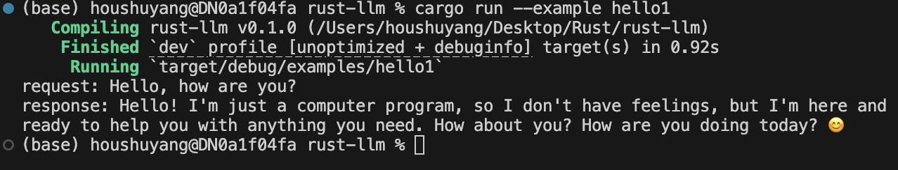

# 🎉 Welcome to **Rust-LLM** – Gateway to Rust-Powered LLMs' Magic! 🎉  
Prepare to embark on a wild ride through the world of Large Language Models (LLMs) with a Rust twist! – We're blending the speed of Rust with the prowess of LLMs. 🚀  

## 🌟 What’s This All About?  
**Rust-LLM** is an open-source library designed to make interacting with LLM APIs. It lets you chat with models like Deepseek, all while leveraging Rust's concurrency superpowers, featuring:
- **Async-first architecture** for concurrent AI conversations
- **Flexible API design** for custom conversation flows
- **Automatic retry logic** with exponential backoff
- **Custom client behavior** via trait implementations


## 🎨 What Can It Do?  
- **Talk to LLMs with Ease**: Use `DeepseekModel` to send messages and get responses. Check out `hello1.rs` for a quick taste!  
- **Custom Client Support**: Implement your own `ClientApi` (see `hello2.rs`) to tailor how your app chats with the world.  
- **Concurrent Conversations**: Handle multiple chats at once with our concurrency magic in `concurrency.rs`. 
- **Retry Logic Built-In**: No more crying over failed API calls – the retry mechanism (powered by `config.rs`) keeps things rolling.  
- **Flexible Configuration**: Tweak models, tokens, and temperatures to your heart’s content via `api.rs` and `lib.rs`.  

## 📚 Project Structure  
Peek under the files:  
```text
rust-llm/
├── Cargo.toml
├── Cargo.lock
├── README.md
├── examples/
│   ├── hello1.rs
│   ├── hello2.rs
│   └── concurrent.rs
├── src/
│   ├── api.rs
│   ├── config.rs
│   └── lib.rs
│   └── error.rs
```

and there is a `llm-test` branch for testing as well.

## 🚀 Getting Started  
0. 🔑 API Key Configuration
   Use environment variables
   ```bash
   # For single run:
   export DEEPSEEK_API_KEY=your_api_key_here
   ```

1. Clone this repo like a boss:  
   ```bash
   git clone https://github.com/crasysky/rust-llm.git
   cd rust-llm
   ```
2. Grab your dependencies with Cargo:  
   ```bash
   cargo build
   ```
3. Run an example and watch the magic unfold:  
   ```bash
   cargo run --example hello1
   ```
4. You can also read the docs of the repository:
   ```bash
   cargo doc --open
   ```

## 🤔 Example results
Following is the result for `hello1.rs`:



Following is the result for `hello2.rs`:


Following is the result for `concurrency.rs`:


## 🎮 Fun Features  
- **Async All the Way**: Built with `tokio` for non-blocking, lightning-fast performance.  
- **Error Handling**: `error.rs` keeps things sane with recoverable and unrecoverable errors.  
- **Conversation Tracking**: The `Conversation` struct in `lib.rs` logs your chats.  

## 🤓 Contribute or Just Gawk  
Found a bug? Got a flashy idea? Fork this repo, tweak it, and send us a pull request! 

## Disclaimer  
You’ll need a Deepseek API key to run the examples. Snag one from their site and keep it safe.

Happy coding! 🦀  
---  
Made by Shuyang Hou and Tianyi Wu


